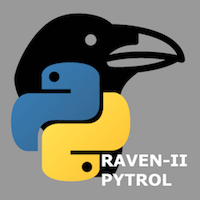
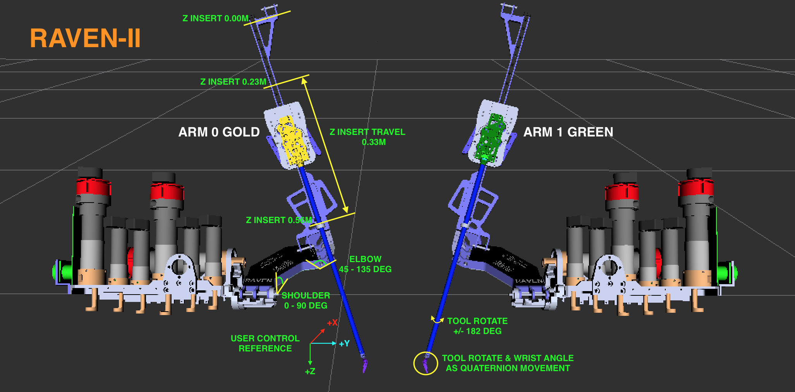
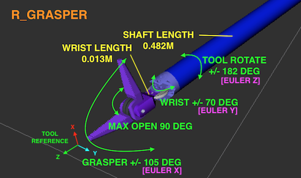
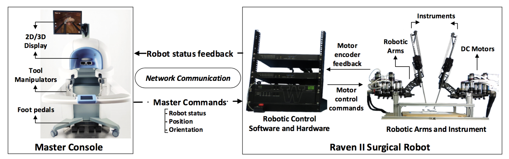

# Raven 2 Python Control

## Project Objective

To provide a simple Python control interface for [Raven 2 Surgical Robot](http://applieddexterity.com/) innovation projects.

### Key Features

* Code in Python and control the Raven 2 through a Python interface
* Execute commands against a Raven 2 simulator
* View resulting movements in ROS rviz visualiser
* Use ROS rqt and GNU GDB to debug issues
* Simple development environment setup

### Latest Version Details

* Python communicates to Raven 2 simulator in cartesian space control mode
* Raven 2 simulator runs on Ubuntu 16.04.5 LTS (Xenial Xerus) / ROS Kinetic Kame

## Getting Started

### Setup the Simulator Environment

#### Prerequisites

* Needs a computer that can allocate 4GB Ram and 20GB Disk Space to a VM
* Needs VMWare Workstation 12 (PC) / VMWare Fusion 8 (Mac) or higher installed

#### Download and Install the Ubuntu VM

1. Download [ubuntu-16.04.5-desktop-i386.iso](http://releases.ubuntu.com/16.04/)
1. View the [ubuntu-16.04.5-desktop-i386.iso checksum](http://releases.ubuntu.com/16.04/SHA1SUMS)
1. Check the downloaded distribution checksum matches e.g.

        $ shasum ubuntu-16.04.5-desktop-i386.iso
        d8433ded588e44584d53281496ac5e9dffebbfd7  ubuntu-16.04.5-desktop-i386.iso

1. Open VMWare or VMWare Fusion, and install a new VM from ubuntu-16.04.5-desktop-i386.iso
1. Use Linux Easy Install:

        Display Name: ravenbot
        Account Name: ravenbot
        Password: [your password]

1. Choose to customise and configure:

        Processor: 1 core
        Disk: 20GB
        Memory: 4096MB
        Network: Share with Host (NAT)

1. Run the Ubuntu 'Software Updater' and process Ubuntu 16.04 LTS software updates

#### Configure Ubuntu VM Realtime Settings

1. Open a new terminal window
1. Allow the ravenbot user to memlock 200MB and change real-time priority to '96' for Raven 2

        $ sudo vi /etc/security/limits.conf

1. Add entries:

        ravenbot        -        memlock        204800
        ravenbot        -        rtprio         96

1. Save and exit terminal window 
1. Logout and then login as ravenbot
1. Open a new terminal window
1. Confirm the settings have been applied

        $ ulimit -l
        204800
        
        $ ulimit -r
        96

#### Install ROS into the VM

1. Open a Firefox browser in Ubuntu
1. Access [ROS Kinetic Kame](http://wiki.ros.org/Installation)
1. Choose ROS Kinetic Kame for platform Ubuntu
1. Follow installation instructions steps 1.1 - 1.7 choosing 'Desktop-Full Install' in step 1.4

        $ sudo sh -c 'echo "deb http://packages.ros.org/ros/ubuntu $(lsb_release -sc) main" > /etc/apt/sources.list.d/ros-latest.list'        
        $ sudo apt-key del 421C365BD9FF1F717815A3895523BAEEB01FA116
        $ sudo apt-key adv --keyserver hkp://ha.pool.sks-keyservers.net:80 --recv-key C1CF6E31E6BADE8868B172B4F42ED6FBAB17C654
        $ sudo apt-get update
        $ sudo apt-get install ros-kinetic-desktop-full
        $ sudo rosdep init
        $ rosdep update
        $ source /opt/ros/kinetic/setup.bash
        $ echo "source /opt/ros/kinetic/setup.bash" >> ~/.bashrc
        $ sudo apt-get install python-rosinstall python-rosinstall-generator python-wstool build-essential

### Initial Build of Project Sources into the VM

#### Pull Raven 2 Source

1. Open a new terminal window
1. Create and initialise the Raven ROS workspace

        $ mkdir ~/raven_ros
        $ cd ~/raven_ros
        $ rosws init ~/raven_ros/ /opt/ros/kinetic
        $ source ~/raven_ros/setup.bash
        $ echo "source ~/raven_ros/setup.bash" >> ~/.bashrc
        $ rosdep update

1. Create a SSH key for the ravenbot user (accept ssh-keygen defaults)

        $ ssh-keygen
        $ eval `ssh-agent`
        $ ssh-add ~/.ssh/id_rsa

1. Open a Firefox browser in Ubuntu
1. Navigate to [GitHub](https://github.com)
1. Create a GitHub user account if you don't have one
1. Navigate to the [raven2_pytrol](https://github.com/qut-merf/raven2_pytrol/) repository
1. Download the raven2_pytrol source to the VM

        $ cd ~/raven_ros
        $ rosws set raven_2 --git https://github.com/qut-merf/raven2_pytrol.git
        $ rosws update raven_2

1. Check git is functioning

        $ cd ~/raven_ros/raven_2
        $ git pull
        $ git status

#### Build the Raven 2 Source and Documentation

1. Compile Raven 2 code (will build with the gcc -Dsimulator option)

        $ cd ~/raven_ros/raven_2
        $ make clean
        $ make

1. Add in the paths needed for ROS rqt to see '/ravenstate' publishing

        $ source ~/raven_ros/raven_2/build/devel/setup.bash
        $ echo "source ~/raven_ros/raven_2/build/devel/setup.bash" >> ~/.bashrc
        $ printenv | grep ROS

1. Install doxygen and make documentation

        $ sudo apt-get install doxygen
        $ cd ~/raven_ros/raven_2/Doxygen
        $ doxygen Doxyfile

1. Open a Firefox browser in Ubuntu
1. Open the Firefox browser file window (Ctrl+O)
1. Navigate to 'raven_ros > raven_2 > html' and open 'index.html' to view documentation

### Pull Updates and Build Project Sources into the VM

1. Open a new terminal window
1. Pull updates (you will need to enter your GitHub username and password)

        $ cd ~/raven_ros/raven_2
        $ git pull

1. Compile Raven 2 code (will build with the gcc -Dsimulator option) 

        $ make clean
        $ make

### Run the Raven 2 Simulator

#### Run in DEBUG MODE and Perform Sanity Checks

1. Start the VM if it is not already running
1. Open a new terminal window

        $ cd ~/raven_ros
        $ roslaunch raven_2 raven_2_rviz_gdb.launch

1. You will need to type 'run' and press enter in the extra GDB Xterm window that launches
1. Check ROS environment settings

        $ cd ~/raven_ros
        $ printenv | grep ROS

1. Check ROS logs exist

        $ ls -l ~/.ros/log/latest

1. Check that '/ravenstate' is being published. CTRL+C to exit

        $ cd ~/raven_ros
        $ rostopic echo /ravenstate

1. Check that '/joint_states' is being published. CTRL+C to exit

        $ cd ~/raven_ros
        $ rostopic echo /joint_states

1. Use CTRL+C in the terminal window you launched from to shutdown the Raven 2
1. Open a new terminal window
1. Run ROS rqt interface and select 'Plugins > Topics > Topic Monitor'

        $ cd ~/raven_ros
        $ rqt

1. Close the ROS rqt window
1. Get the IP address of the VM

        $ ifconfig

1. Check the computer host machine (not the VM) can send UDP to the Raven 2 while it is running (OSX example)

        $ echo "baddata" | nc -4cu 192.168.6.136 36000

1. You should see a 'ERROR: Rec'd wrong u_struct size on socket!' in Raven terminal window in VM
1. Use CTRL+C in the terminal window you launched from to shutdown the Raven 2

#### Run in NORMAL MODE

1. Start the VM if it is not already running
1. Open a new terminal window
1. Run in normal mode

        $ cd ~/raven_ros
        $ roslaunch raven_2 raven_2_rviz.launch

1. Use CTRL+C in the terminal window you launched from to shutdown the Raven 2

### Setup the Python Development Environment

#### Prerequisites

* [Git](https://help.github.com/articles/set-up-git/) installed on your development computer
* [Python 3.6 or above](https://www.python.org/downloads/) installed on your development computer

#### Pull Raven 2 Source

1. If you don't have a [GitHub](https://github.com) account, then create an account
1. If you don't have a SSH key, then [setup](https://help.github.com/articles/generating-an-ssh-key/) SSH on your development computer
1. Navigate to the [raven2_pytrol](https://github.com/qut-merf/raven2_pytrol/) repository
1. [Clone](https://help.github.com/articles/cloning-a-repository/) the repository to your development computer
1. Check git is functioning

        $ cd [repository path]/raven2_pytrol
        $ git pull
        $ git status

#### Install PyCharm

1. If you don't have PyCharm, then [download](https://www.jetbrains.com/pycharm/download/) PyCharm Community Edition
1. If you don't have PyCharm, then [install](https://www.jetbrains.com/help/pycharm/install-and-set-up-pycharm.html) PyCharm on your development computer

#### Create the Pytrol Project

1. Open Pycharm on your development computer
1. Choose 'Create New Project'
1. Set the Location to the '[your repository path]/raven2_pytrol/pytrol/' directory
1. Choose to use a 'New Virtual Environment' and ensure the base interpreter is 'python3.6' (or above)
1. Click 'Create' and choose **NO** when prompted with the option to create from existing sources

#### Run the Python Control Example

1. Start the VM and run the Raven Simulator (see instructions above)
1. Open a new terminal window in the VM
1. Get the IP address of the Raven Simulator VM

        $ ifconfig

1. Open Pycharm on your development computer
1. Open the 'pytrol' project
1. Open 'Pytroller.py' file
1. Set the 'UDP_IP_RAVEN' variable in 'Pytroller.py' to the IP address of the Raven Simulator VM
1. Right-Click in the PyCharm editor window and click 'Run pytroller'
1. You should see the Raven move in ROS rviz window in the VM

## Other Useful Reference Material

* The flowchart diagrams help understand program execution flow
    * [flowcharts/init_cpp.pdf](flowcharts/Init_cpp.pdf)
    * [flowcharts/homing_cpp.pdf](flowcharts/homing_cpp.pdf)
    * [flowcharts/console_process_cpp.pdf](flowcharts/console_process_cpp.pdf)
    * [flowcharts/network_layer_cpp.pdf](flowcharts/network_layer_cpp.pdf)
    * [flowcharts/rt_raven_cpp.pdf](flowcharts/rt_raven_cpp.pdf) (This diagram is a good starting point)
    * [flowcharts/mapping_cpp.pdf](flowcharts/mapping_cpp.pdf)
* This [IEEE publication](http://bionics.seas.ucla.edu/publications/JP_28.pdf) describes the system and kinematic model
* This [UWEE Research Paper](http://brl.ee.washington.edu/eprints/39/1/UWEETR-2012-0006.pdf) details the kinematic model
* This [US Patent](http://pdfpiw.uspto.gov/.piw?PageNum=0&docid=06969385) describes the grasper
* The following diagram provides some information on the Raven 2 (warning, this is very draft)

* The following diagram provides some information on the Raven 2 r_grasper (warning, this is very draft)

* It is good to understand how a surgeon controls the robot in a human operated master control setup
    * The surgeon uses a haptic device (e.g. [Sensable Phantom Omni](pytrol/pytrol/doc/PHANToMOMNIHapticDeviceKinematicandManipulability.pdf)) to control each robot arm
    * An example of typical surgeon master control setup (obtained from [this research document](pytrol/pytrol/doc/MedicalCPS_2015.pdf))

## Authors

* **Professor Cameron Brown** (Project Sponsor) - [profile](https://research.qut.edu.au/pmbm/people/cameron-brown/)
* **James Levander** - [profile](https://www.linkedin.com/in/james-levander-b8b0171/)

## License

This project is licensed under the GNU Lesser General Public License - see the [LICENSE](LICENSE.md) file for details

## Acknowledgments

* Raven 2 source from fork of [uw-biorobotics/raven2](https://github.com/uw-biorobotics/raven2)
* Raven 2 ROS rviz setup from [UVA-DSA/raven2_sim](https://github.com/UVA-DSA/raven2_sim)

